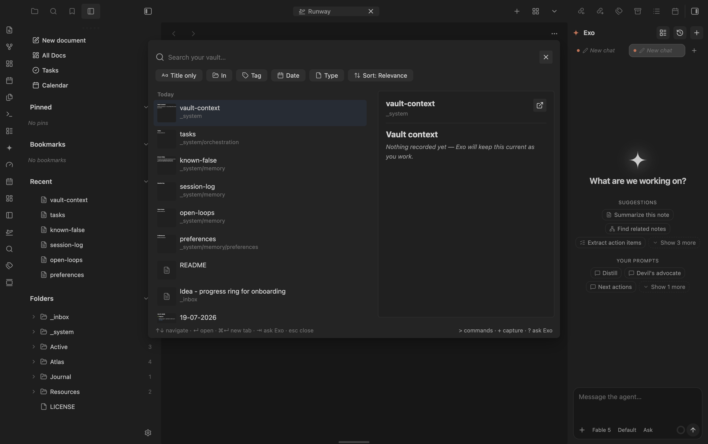

# Sonar

A fast, relevance-first **omni-bar** for Obsidian. One ping and the right thing
surfaces — open a note, run a command, capture a thought, or hand an intent to
Exo. Search is still the core (a from-scratch BM25F engine that ranks better
than Omnisearch, with a drop-in HTTP API); it's now one of four modes.

Part of the marioverse Obsidian plugin suite.

<p align="center">
  
</p>
<p align="center"><em>Search results with a live preview panel, filter chips, and mode hints in the footer.</em></p>

## Why

Omnisearch is good, but its always-on fuzziness pollutes results and its ranking doesn't let title matches dominate. Sonar is a from-scratch BM25F engine tuned so the note you meant is at the top: title/heading/tag hits outweigh body repetition, prefix matching works as you type, and fuzzy only kicks in when exact matching comes up short.

## Features

- **BM25F field-weighted ranking** — basename ≫ aliases > headings > tags > body, with document-length normalization. A single title hit beats heavy body repetition.
- **Exact › prefix › fuzzy tiering** — exact matches always rank first; the last token you type is matched as a prefix (as-you-type); fuzzy (edit distance 1–2) catches typos in note bodies.
- **Configurable body fuzzy** — choose when body fuzzy fires: `off`, `on when sparse` (default — only when strong matches are few), or `always`.
- **Universal file finder** — find *any* file in the vault by name, regardless of type: PDFs, images, `.canvas`, `.base`, HTML, archives, media. A subsequence matcher (fzf-style: `srvc` → `search-service`) ranks names, and each result shows a per-type icon. Non-text files you could never search before are now one query away.
- **Phrase & proximity** — `"quoted phrases"` get an adjacency boost; terms appearing near each other rank higher.
- **Operators** — `path:`, `tag:`, `-exclude`, `"exact phrase"`.
- **Diacritics folding** — `perche` matches `perché`. Mixed Italian/English, no stemming (prefix matching covers morphology).
- **Recency boost** — recently modified notes get a gentle lift.
- **HTML content** — `.html` files are parsed natively (no plugin) and their text is indexed and searchable — great for generated artifacts. Toggle with **Index HTML content**.
- **Attachments** — indexes text from PDFs and images via the [Text Extractor](https://github.com/scambier/obsidian-text-extractor) plugin, when installed.
- **Omnisearch-compatible HTTP API** — optional `GET /search?q=` on `localhost:51361`, same JSON shape, so existing tooling (scripts, `recall.sh`) keeps working.
- **Fast** — cold index build well under 3s on a 7k-note vault, warm boot from a binary cache in ~200ms, per-keystroke queries in single-digit milliseconds.

## Modes

Type a leading sigil to switch mode; backspace on an empty input returns to search.

| Input        | Mode    | Does                                                      |
|--------------|---------|----------------------------------------------------------|
| `hello`      | Search  | BM25F search across the vault (the default).             |
| `> annotate` | Command | Run any Obsidian or suite-plugin command, frecency-ranked.|
| `+ an idea`  | Capture | Append raw text to today's daily under `## 🌱 Capture`. `[ ]` → a dated task. |
| `? summarise`| Intent  | Hand the request to Exo, which executes it via Sonar's action tools. |

## Usage

- **Command**: “Sonar: Search vault” (bind a hotkey) or the ribbon search icon.
- **Keyboard**: `↑↓` navigate · `↵` open · `⌘↵` open in new tab · `esc` close.
- When there are few matches, a “Create note” row lets you make the note you searched for.

## Settings

- **Max results**, **Show score (debug)** — the debug toggle shows per-result scores and query timing, for tuning.
- **Index PDFs / images**, **Max attachment size** — attachment indexing (needs Text Extractor).
- **HTTP API** — enable + port (default 51361). Desktop only. If the port is taken (Omnisearch still has its API on), you'll see a clear notice; disable Omnisearch's HTTP server or change Sonar's port.
- **Rebuild index** — discard and rebuild from scratch.

## HTTP API

```
GET http://localhost:51361/search?q=<url-encoded query>
→ [{ score, path, basename, excerpt, foundWords, matches: [{ match, offset }] }]

GET http://localhost:51361/health
→ { status, ready, docs }
```

The `/search` response matches Omnisearch's shape, so it's a drop-in replacement. Disable Omnisearch's HTTP API first to free the port.

The server binds only to `127.0.0.1`, accepts loopback `Host` headers only, and
does not enable browser CORS. This keeps arbitrary websites and DNS-rebinding
hosts from reading filenames or note excerpts. The API is disabled by default.

## Privacy

Sonar indexes and searches vault content locally. It sends no note content,
telemetry, or analytics to the plugin author or to a Sonar service. The optional
HTTP API exposes search results only to local non-browser clients and remains
off until explicitly enabled.

## Architecture

The ranking engine (`src/index/`) is pure TypeScript with zero Obsidian imports, fully unit-tested headless:

| Module | Responsibility |
|---|---|
| `tokenizer` | Folding, segmentation, camelCase/URL handling, positions — shared by indexing, query parsing, and highlighting |
| `query` | Operator/phrase/prefix parsing |
| `inverted-index` | Flat-postings inverted index, lazy deletion, prefix range, compaction |
| `field-extract` | Note content + metadata → per-field token streams |
| `bm25f` · `fuzzy` | Scoring (field weights, tiering, coverage, proximity, recency) |
| `excerpt` | Densest-window excerpt selection with highlight ranges |
| `search-core` | Parse → retrieve → filter → rank orchestration |
| `serialize` | Binary index cache (fast warm boot) |
| `fuse` | Reciprocal Rank Fusion (for the Wave 2 semantic provider) |

The Obsidian layer (`src/service/`, `src/ui/`, `src/main.ts`) owns the index lifecycle, the modal, and the HTTP server. A `SearchProvider` interface lets a future semantic provider ([QMD](https://github.com/tobi/qmd)) register alongside keyword search and fuse in.

## Mobile

**Playable** — `isDesktopOnly: false` in `manifest.json`; `styles.css` has `.is-phone` layout rules and a `max-width: 600px` responsive query, but no `pointer: coarse` media query or 44px/44pt touch targets yet.

## Development

```bash
pnpm install
pnpm dev        # watch build → deploys to the vault at .obsidian-plugin-dir
pnpm build      # typecheck + production build
pnpm test       # vitest (headless engine tests)
pnpm bench      # synthetic 7k-doc performance benchmark
```

Create a `.obsidian-plugin-dir` file containing the absolute path to your vault's `.obsidian/plugins/sonar` to have builds deploy there automatically.

## Roadmap

- **Wave 2 — semantic search**: a QMD-backed `deep` provider (local embeddings + reranking) fused with keyword results via RRF, for concept-level recall beyond keywords.

## Try it

See it running in the [Obsidianverse sample vault](https://github.com/mariomile/obsidianverse-sample-vault) — a small, fictional vault with the whole plugin suite pre-configured.

